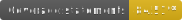
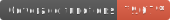
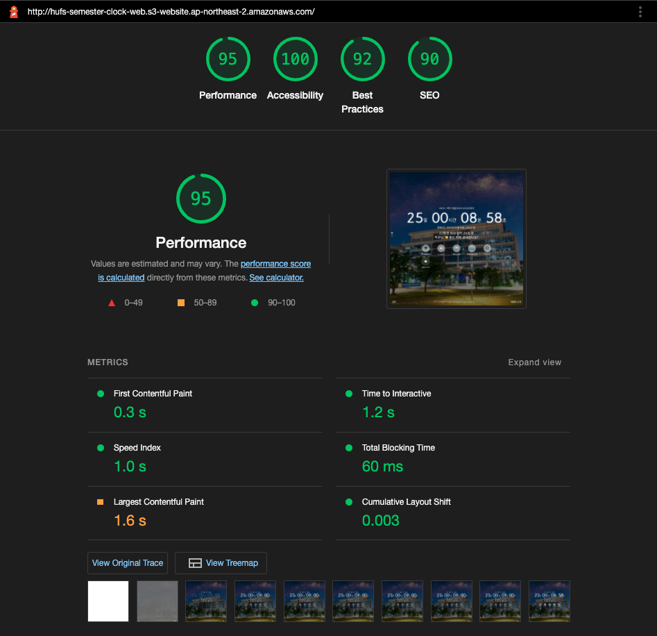
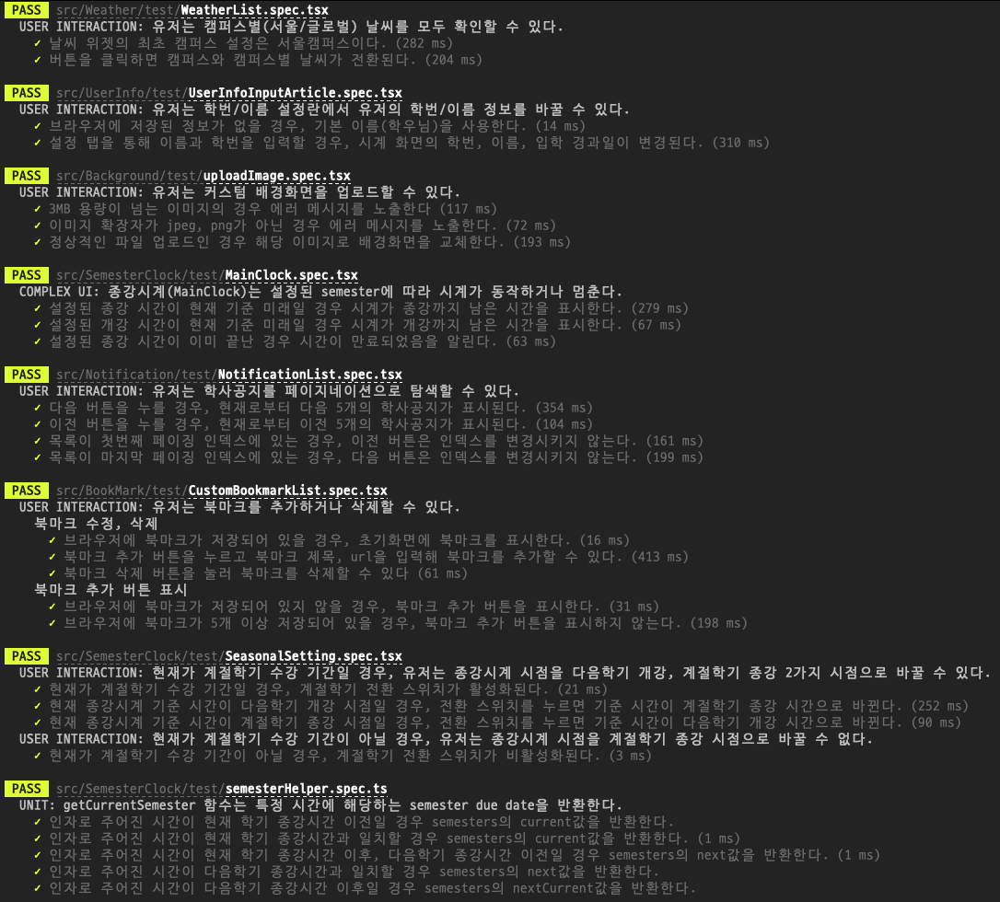
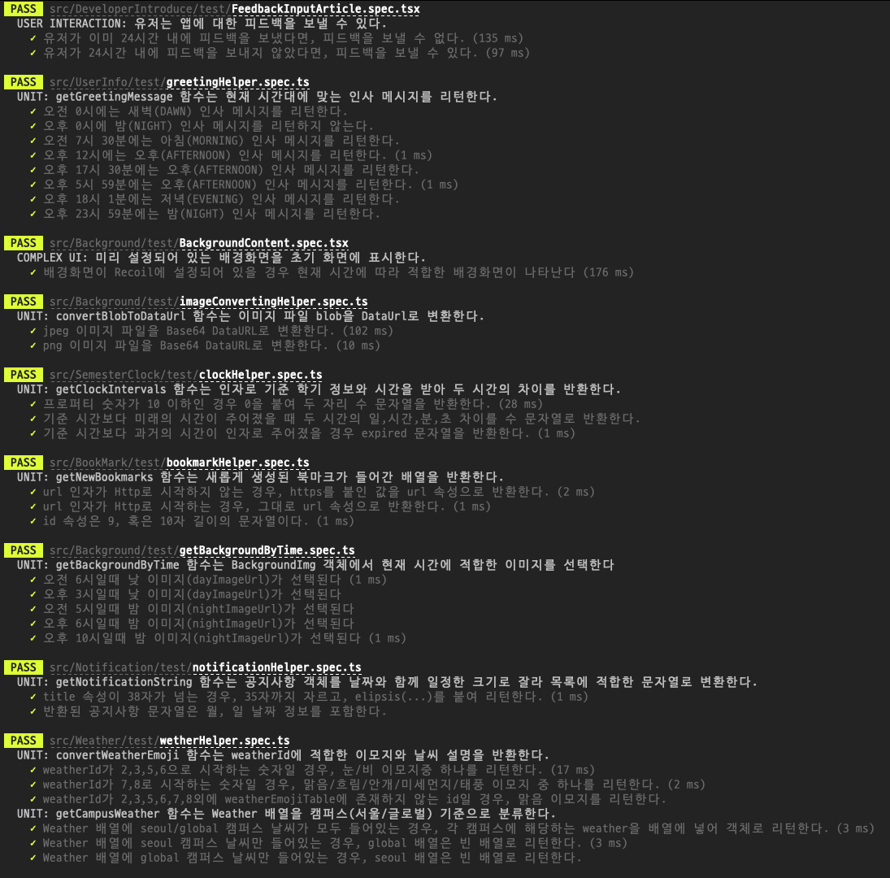
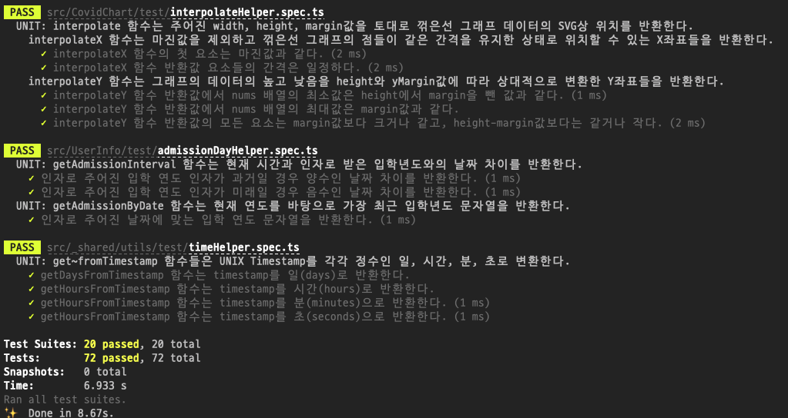

# 외대 종강시계 V2

    
 

> **HUFS Semester Clock V2**  
외대생을 위한, 종강까지 얼마나 남았는지 보여주는 크롬 익스텐션

- 🧩 [크롬 웹 스토어](https://chrome.google.com/webstore/detail/%EC%99%B8%EB%8C%80-%EC%A2%85%EA%B0%95%EC%8B%9C%EA%B3%84/jadlpknbgnmmelikpcaogikohieafaem?hl=ko)
- 🧩 [웨일 웹 스토어](https://store.whale.naver.com/detail/mckjnmgioalpnggjipjkmadnandhomei)
- 🌐 [웹 버전](http://hufs-semester-clock-web.s3-website.ap-northeast-2.amazonaws.com/)

## ✅ 주요 기능

- 새로운 탭을 생성하면 크롬의 디폴트 배경화면 대신, 익스텐션이 제공하는 배경 이미지와 기능이 제공됩니다.
- 학기 중에는 종강까지 남은 시간을 보여줍니다.
- 방학 중에는 계절학기 종강까지 or 다음학기 개강까지 남은 시간을 보여줍니다.
- 학번과 이름을 입력하면 시간에 따른 랜덤 멘트와 입학한 날짜로부터 얼마나 지났는지 볼 수 있습니다.
- 배경화면을 유저가 업로드한 파일을 통해 커스텀 가능합니다.
- 학사 공지 조회와 이문동 날씨 조회, 사용자 커스텀 북마크, 코로나 현황, 오늘 뭐먹지 등 시계 외의 여러 유용한 부가 기능을 사용하실 수 있습니다.

## v2.0.0에서의 개선점

### 기능적 관점

- 최소한의 인터랙션으로 모든 부가기능을 쉽게 사용할 수 있는 새로운 디자인, UX 적용
- 각 기능들에 대해 새로운 디자인 적용
- 타이머, 커스텀 북마크 추가, 개발자에게 피드백 보내기 기능 새로 구현
- 애니메이션, 스켈레톤 UI 추가하여 사용자 반응성 향상
- 유저 인풋에 에러, 로딩 텍스트 추가하여 반응성 향상
- 멈추지 않는 시계 : v1.x.x 에서는 종강 시점 시간이 지나면 시계 숫자들이 음수로 표시되어 새로고침이 필요했지만, 시계 만료 UI 구현해 유저가 시계를 재시작할 수 있도록 함

### 기술적 관점

- Vue+Javascript로 구현되었던 V1 코드를 React+Typescript로 리라이팅
- 기존에 Firebase SDK에 직접 의존하는 쿼리를 REST API로 대체하고 Firebase SDK를 번들에서 제거
- Suspense for Data Fetching, React Query, Error Boundary를 이용한 선언적 비동기 구현
- Jest, react-testing-library 이용한 72개의 유닛, 통합 테스트 코드 작성
- Webpack 크롬 익스텐션 보일러 플레이트 직접 처음부터 구현
  - 웹 배포용 번들, 익스텐션 배포용 번들 모두 만들 수 있는 환경과 웹팩 설정 구현
- 코드 스플리팅을 이용한 번들 크기 축소, 앱 전체 번들 크기 축소(290KiB -> 180KiB, 기능은 더 많아졌는데 번들은 더 작아짐)
- Manifest 3로 업데이트
- FCP(First Contentful Paint) 기존 1.5.x버전 1.1초에서 0.3초로 단축
- 스크린 리더 디버깅을 병행하며, 웹표준과 웹 접근성을 준수한 마크업 작성
  - LightHouse 기준 접근성 100점

### 테스트 케이스와 테스트 전략

2022.01.29 기준  

- UI를 만드는데 필요한 코어 로직을 순수함수로 분리하고 Jest를 통한 유닛 테스트를 붙이고, 필요한 경우 RTL을 통한 컴포넌트 테스트를 붙이는 테스트 전략을 수립했습니다.
- 컴포넌트의 구조가 복잡하지 않아 유닛 테스트로 기능의 상당 부분이 커버되는 경우는 컴포넌트 테스트를 붙이지 않았고, 컴포넌트의 구조가 복잡한 경우에만 컴포넌트 테스트를 붙였습니다.
- 아쉬운점 : 유닛 테스트를 많이 붙여 컴포넌트의 데이터 종속성(서버 데이터나 전역 상태관리 도구)에 상관없이 개발과 병행하며 핵심 기능들을 적은 비용으로 빨리 테스트 할 수 있다는 점에서는 좋았으나, 
  일반적인 경우 모듈보다는 기능의 존재가 코드베이스에서 더 오래가기 때문에 모듈들이 많이 변하고 UI는 그대로인 변경 사항이 생길 경우 유닛 테스트를 많이 고쳐야 할 것 같습니다. [제일 가성비가 좋은 
  테스트는 통합 테스트](https://blog.sapegin.me/all/react-testing-1-best-practices/)라는 것을 어느정도 실감하며, 기능에 대한 테스트 케이스를 엄선하여 유지보수가 가능할 정도의 컴포넌트 테스트 케이스를 붙이고 유지보수해나가는게 좋은 전략이 아닐까 싶었습니다..
- 접두어를 통해 테스트케이스 종류를 구분합니다.
  - COMPLEX UI : 컴포넌트의 동작이 테스트해봐야 할 정도로 복잡한 경우에 하는 컴포넌트 테스트(RTL)
  - USER INTERACTION : 유저와 상호작용 하는 경우에 하는 컴포넌트 테스트(RTL)
  - UNIT : 앱의 Core를 이루는 로직들에 대한 유닛 테스트(Jest)

## 앞으로

- preact 도입 고려하기 : 더 작은 React 라이브러리로 대체해 번들 크기 더 효율화
- 화면 전환시 보이지 않는 요소 focus할 수 없게 만들어 키보드 사용성 향상
- 빌드 환경 개선 : 웨일, 크롬 스토어가 다른 Manifest 버전을 지원하므로, 한번 빌드로 번들을 2개씩, 압축해서 만드는 빌드 환경 구축
- 모니터링 환경 만들기 : firebase functions 함수 호출 모니터링 환경 만들기
- 기능 추가 : 위젯 위치 커스텀 기능, 새로운 위젯 계속해서 추가
- 웹 버전에 HTTPS 붙이기
- (장기적으로) 백엔드 엔드포인트만 바꿔서 다른 학교 지원하기..?
- (장기적으로) 크롬 익스텐션 원격 코드 환경 알아보기

## 버전

- [릴리즈 노트](https://github.com/MaxKim-J/hufs-semester-clock-v2/releases)
- [v1.x.x 릴리즈 노트](https://github.com/MaxKim-J/HUFS-Semester-Clock-Extension/releases)
